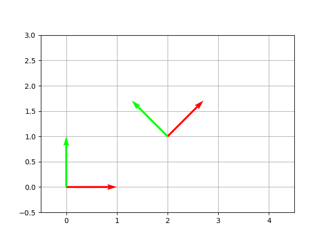

# Sistemas de Coordenadas (2D)

## CoordinateSystem2D

Um sistema de coordenadas 2D definido por dois eixos `Direction2D` e uma origem `Point2D`. Internamente constrói uma matriz afim 3×3 usada para transformações de mudança de base.

```kotlin
import plane.CoordinateSystem2D
import plane.elements.Direction2D
import plane.elements.Point2D
import units.Angle

// Sistema cartesiano padrão (x à direita, y para cima, origem em 0,0)
val standard = CoordinateSystem2D.MAIN_2D_COORDINATE_SYSTEM

// Sistema rotacionado — eixos inclinados 45°
val rotado = CoordinateSystem2D(
    xDirection = Direction2D(1.0, 1.0),   // normalizado automaticamente
    yDirection = Direction2D(-1.0, 1.0),
    origin     = Point2D(2.0, 0.0)
)
```

### Propriedades

| Membro | Descrição |
|---|---|
| `xDirection: Direction2D` | direção unitária do eixo x |
| `yDirection: Direction2D` | direção unitária do eixo y |
| `origin: Point2D` | origem do sistema |
| `affineMatrix: SimpleMatrix` | matriz de transformação afim 3×3 |

### Rotação

Retorna um novo `CoordinateSystem2D` com seus eixos e origem rotacionados:

```kotlin
val sys = CoordinateSystem2D.MAIN_2D_COORDINATE_SYSTEM
val rotado = sys.rotate(Angle.Degrees(30.0))
```

O gráfico abaixo mostra o sistema cartesiano padrão (vermelho/verde na origem) ao lado de um sistema personalizado rotacionado 45° ancorado em (2, 1):



---

## Mudança de base

Qualquer `Entity2D` pode ser reexpresso em outro sistema de coordenadas usando `changeBasis()`:

```kotlin
val sistemaA = CoordinateSystem2D(
    xDirection = Direction2D(1.0, 0.0),
    yDirection = Direction2D(0.0, 1.0),
    origin     = Point2D(1.0, 0.0)
)

val sistemaB = CoordinateSystem2D.MAIN_2D_COORDINATE_SYSTEM

val ponto = Point2D(2.0, 1.0)  // como escrito no sistemaA

// Expressar o mesmo ponto no sistemaB
val pontoEmB = ponto.changeBasis(asWrittenIn = sistemaA, to = sistemaB)
```

Internamente isso computa:

```
sistemaB.affineMatrix⁻¹ × sistemaA.affineMatrix × ponto.affineMatrix
```

### Exemplo prático — expressando um polígono em um referencial inclinado

```kotlin
import plane.Polygon2D
import plane.CoordinateSystem2D
import plane.elements.Direction2D
import plane.elements.Point2D
import units.Angle

val quadrado = Polygon2D(listOf(
    Point2D(0.0, 0.0),
    Point2D(1.0, 0.0),
    Point2D(1.0, 1.0),
    Point2D(0.0, 1.0)
))

val sistemaInclinado = CoordinateSystem2D(
    xDirection = Direction2D(1.0, 1.0),
    yDirection = Direction2D(-1.0, 1.0),
    origin     = Point2D(0.5, 0.5)
)

val quadradoInclinado = quadrado.changeBasis(
    asWrittenIn = CoordinateSystem2D.MAIN_2D_COORDINATE_SYSTEM,
    to          = sistemaInclinado
)
```
