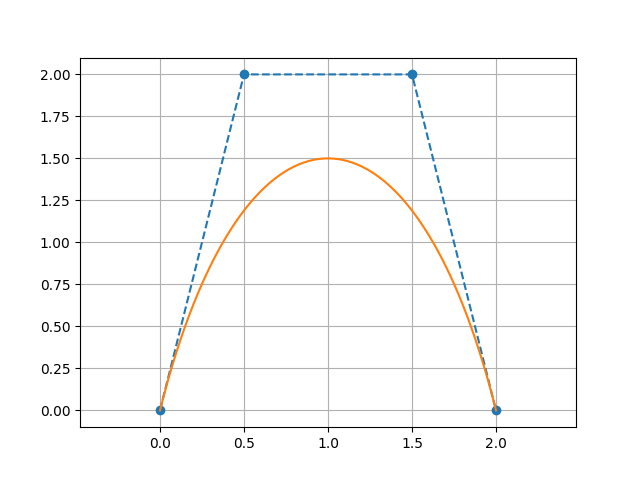
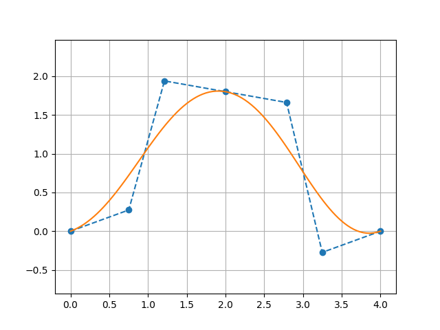

# Parametric Curves (2D)

## ParametricCurve2D

The base class for 2D parametric curves. A `ParametricCurve2D` holds two `Function2D` instances — one for x(t) and one for y(t) — and evaluates the curve for t ∈ [0, 1].

```kotlin
import plane.ParametricCurve2D
import plane.functions.Polynomial

// Circle: x(t) = cos(2πt), y(t) = sin(2πt)  (approximated with polynomials here)
val circle = ParametricCurve2D(
    xParametricFunction = Polynomial(listOf(1.0, 0.0, -2.0)),  // any Function2D
    yParametricFunction = Polynomial(listOf(0.0, 1.0, -1.0))
)

val point: Point2D = circle(0.25)   // evaluate at t = 0.25
```

### Evaluation

```kotlin
// Single parameter
val p = curve(0.5)

// Multiple parameters at once
val points: List<Point2D> = curve(listOf(0.0, 0.25, 0.5, 0.75, 1.0))
```

### Derivative and integration

```kotlin
// dy/dx at a given t (via chain rule)
val slope = curve.derivative(0.5)

// Approximate arc-length integral (numerical, default 200 points)
val length = curve.integrate(0.0, 1.0)
val length2 = curve.integrate(0.0, 0.5, nPoints = 500u)
```

---

## BezierCurve

A Bézier curve of any degree defined by a list of control points. The curve passes through the **first and last** control points; intermediate control points act as attractors.

Internally the x and y parametric functions are constructed from [Bernstein basis polynomials](https://en.wikipedia.org/wiki/Bernstein_polynomial).

### Construction

```kotlin
import plane.BezierCurve
import plane.elements.Point2D

// Cubic Bézier (4 control points)
val bezier = BezierCurve(listOf(
    Point2D(0.0, 0.0),   // start (on curve)
    Point2D(0.5, 2.0),   // control point 1
    Point2D(1.5, 2.0),   // control point 2
    Point2D(2.0, 0.0)    // end (on curve)
))
```

Any number of control points is accepted; the degree equals `n - 1` where `n` is the count.

```kotlin
// Linear (2 points) — straight line
val line = BezierCurve(listOf(Point2D(0.0, 0.0), Point2D(1.0, 1.0)))

// Quadratic (3 points)
val quad = BezierCurve(listOf(
    Point2D(0.0, 0.0),
    Point2D(1.0, 2.0),
    Point2D(2.0, 0.0)
))
```

### Evaluation

```kotlin
val start = bezier(0.0)   // always equals controlPoints.first()
val end   = bezier(1.0)   // always equals controlPoints.last()
val mid   = bezier(0.5)
```

### Accessing control points

```kotlin
bezier.controlPoints.forEach { println(it) }
```

### Visualization

```kotlin
// requires geomez-visualization
bezier.plot()   // shows curve + control polygon with dashed lines
```



---

## CubicBezierSpline2D

A piecewise cubic Bézier spline: a sequence of cubic Bézier segments joined at shared endpoints.

### Control point layout

The flat control-point list must have **4 + 3n** points (where n ≥ 0 is the number of additional segments):

```
[P0, P1, P2, P3 | P4, P5, P6 | P7, P8, P9 | ...]
 ← segment 0 →   ← seg 1 →    ← seg 2 →
```

P3 from segment 0 and P3 for segment 0 are the same point as the start of segment 1 (P3 = start of segment 1).

```kotlin
import plane.CubicBezierSpline2D
import plane.elements.Point2D

// Two cubic Bézier segments (7 = 4 + 3×1 control points)
val spline = CubicBezierSpline2D(listOf(
    Point2D(0.0, 0.0),   // seg 0 start (on curve)
    Point2D(0.3, 1.0),   // seg 0 cp1
    Point2D(0.7, 1.0),   // seg 0 cp2
    Point2D(1.0, 0.0),   // seg 0 end = seg 1 start (on curve)
    Point2D(1.3, -1.0),  // seg 1 cp1
    Point2D(1.7, -1.0),  // seg 1 cp2
    Point2D(2.0, 0.0)    // seg 1 end (on curve)
))

val p = spline(0.5)   // global t ∈ [0,1]
```

### Building from smooth segments

`SmoothCubicBezierSplineControlPoints` lets you specify each anchor by its position and tangent angle, so the control points are derived automatically:

```kotlin
import plane.CubicBezierSpline2D
import plane.elements.Point2D
import plane.elements.SmoothCubicBezierSplineControlPoints
import units.Angle

val spline = CubicBezierSpline2D(listOf(
    SmoothCubicBezierSplineControlPoints(
        pointOnCurve              = Point2D(0.0, 0.0),
        angle                     = Angle.Degrees(0.0),
        distanceControlPointBefore = null,    // first segment: no "before" handle
        distanceControlPointAfter  = 0.5
    ),
    SmoothCubicBezierSplineControlPoints(
        pointOnCurve              = Point2D(2.0, 1.0),
        angle                     = Angle.Degrees(30.0),
        distanceControlPointBefore = 0.5,
        distanceControlPointAfter  = 0.5
    ),
    SmoothCubicBezierSplineControlPoints(
        pointOnCurve              = Point2D(4.0, 0.0),
        angle                     = Angle.Degrees(0.0),
        distanceControlPointBefore = 0.5,
        distanceControlPointAfter  = null     // last segment: no "after" handle
    )
))
```

### Accessing individual segments

```kotlin
spline.bezierCurves.forEachIndexed { i, segment ->
    println("Segment $i: ${segment.controlPoints}")
}
```

### Visualization

```kotlin
// requires geomez-visualization
spline.plot()
```


