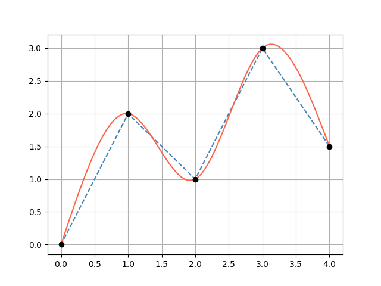

# Scalar Functions (2D)

The `Function2D` interface represents a scalar function **f(x) → Double** and is the foundation for splines, parametric curves, and Bézier curves.

## Function2D interface

```kotlin
interface Function2D {
    operator fun invoke(x: Double): Double
    operator fun invoke(xArray: DoubleArray): List<Double>
    operator fun invoke(xCollection: Collection<Double>): List<Double>
    fun derivative(x: Double): Double
    fun integrate(xStart: Double, xEnd: Double): Double
    fun tangentDirection(x: Double): Direction2D
    fun normalDirection(x: Double): Direction2D
}
```

---

## Polynomial

A polynomial whose coefficients are ordered from the **lowest degree to the highest**:

```
Polynomial([a0, a1, a2, a3]) = a0 + a1·x + a2·x² + a3·x³
```

```kotlin
import plane.functions.Polynomial

// p(x) = 1 + 2x + 3x²
val p = Polynomial(listOf(1.0, 2.0, 3.0))

println(p(2.0))          // 1 + 4 + 12 = 17.0
println(p.order)         // 2
```

### Derivative and integral

```kotlin
val p = Polynomial(listOf(1.0, 2.0, 3.0))   // 1 + 2x + 3x²

// Analytical derivative → 2 + 6x
val dp = p.derivative()
println(dp(1.0))   // 8.0

// Analytical indefinite integral (integration constant = 0)
val ip = p.integral()

// Definite integral between bounds
val area = p.integrate(0.0, 2.0)
```

### Arithmetic between polynomials

```kotlin
val p1 = Polynomial(listOf(1.0, 2.0))   // 1 + 2x
val p2 = Polynomial(listOf(0.0, 1.0))   // x

val sum     = p1 + p2          // 1 + 3x
val product = p1 * p2          // x + 2x²
val squared = p1 pow 2         // (1 + 2x)²
```

### Scalar arithmetic

```kotlin
val p = Polynomial(listOf(1.0, 2.0, 3.0))

val shifted  = p + 5.0    // adds 5 to the constant term
val scaled   = p * 2.0    // multiplies every coefficient by 2
val halved   = p / 2.0
```

---

## LinearSpline

Piecewise linear interpolation through a set of `Point2D` nodes. x-values must be strictly ascending.

```kotlin
import plane.functions.LinearSpline
import plane.elements.Point2D

val spline = LinearSpline(listOf(
    Point2D(0.0, 0.0),
    Point2D(1.0, 2.0),
    Point2D(2.0, 1.0),
    Point2D(3.0, 3.0)
))

println(spline(0.5))              // 1.0  (midpoint of first segment)
println(spline.derivative(0.5))   // 2.0  (slope of first segment)
println(spline.integrate(0.0, 3.0))
```

!!! note
    The derivative is constant within each segment and undefined at knots (returns the slope of the left segment).

---

## CubicSpline

A natural cubic spline (second derivative = 0 at both endpoints) fitted through a set of `Point2D` nodes. Requires **at least 4 points** with strictly ascending x-values.

Each segment between two consecutive knots is represented as a `Polynomial` of degree ≤ 3.

```kotlin
import plane.functions.CubicSpline
import plane.elements.Point2D

val spline = CubicSpline(listOf(
    Point2D(0.0, 0.0),
    Point2D(1.0, 2.0),
    Point2D(2.0, 1.5),
    Point2D(3.0, 3.0),
    Point2D(4.0, 1.0)
))

val y     = spline(1.5)               // interpolated value
val slope = spline.derivative(1.5)    // smooth first derivative
val area  = spline.integrate(0.0, 4.0)
```

### Accessing the underlying polynomials

```kotlin
spline.polynomials.forEachIndexed { i, poly ->
    println("Segment $i: coefficients = ${poly.coefficients}")
}
```

### Visualization

```kotlin
// requires geomez-visualization
spline.plot()
```

The blue dashed line shows a `LinearSpline` and the red line a `CubicSpline` through the same knot points (black dots):



---

## Tangent and normal directions

All `Function2D` implementations expose:

```kotlin
val spline = CubicSpline(points)

// Unit tangent direction at x = 1.5
val tangent = spline.tangentDirection(1.5)   // Direction2D

// Unit normal direction (perpendicular, anti-clockwise)
val normal  = spline.normalDirection(1.5)    // Direction2D
```
