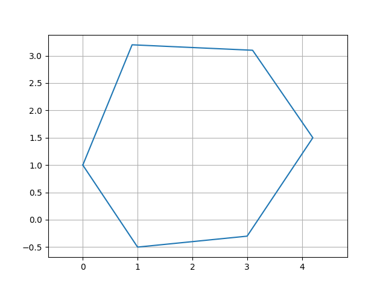
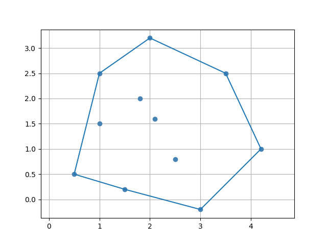

# Polygons & Collections (2D)

## List&lt;Point2D&gt; Extensions

`List<Point2D>` has extension functions for coordinate extraction, bounding-box queries, arc-length, centroid, and parametric functions. These are available on any `List<Point2D>`, including the `points` property of `Curve2D`, `Polygon2D`, `LinearSpline`, and `CubicSpline`.

| Extension | Type | Description |
|---|---|---|
| `xPoints` | `List<Double>` | x-coordinates |
| `yPoints` | `List<Double>` | y-coordinates |
| `length` | `Double` | Arc length (sum of segment lengths) |
| `centroid` | `Point2D` | Arithmetic mean of all points |
| `minX`, `maxX` | `Double` | x-axis bounds |
| `minY`, `maxY` | `Double` | y-axis bounds |

```kotlin
val curve = Curve2D(Point2D(0.0, 0.0), Point2D(1.0, 1.0), Point2D(2.0, 0.0))

println(curve.points.length)      // arc length
println(curve.points.centroid)    // mean point
println(curve.points.minX)        // 0.0
```

### Range checks

```kotlin
curve.points.inXRange(1.5)   // true if 1.5 is within [minX, maxX]
curve.points.inYRange(2.0)   // false if 2.0 is outside [minY, maxY]
```

### Parametric functions from the point list

Extract `Function2D` objects by interpolating the point list:

```kotlin
val xFn: Function2D = curve.points.xParametricFunction()
val yFn: Function2D = curve.points.yParametricFunction()
```

---

## Curve2D

An open, ordered sequence of `Point2D` values. Supports concatenation and arithmetic transforms.

```kotlin
import plane.Curve2D
import plane.elements.Point2D

val c1 = Curve2D(Point2D(0.0, 0.0), Point2D(1.0, 1.0))
val c2 = Curve2D(Point2D(1.0, 1.0), Point2D(2.0, 0.0))

val combined: Curve2D = c1.concat(c2)
```

### Arithmetic

```kotlin
val c = Curve2D(Point2D(0.0, 0.0), Point2D(1.0, 1.0))

// Translate all points by a vector
val shifted = c + Point2D(1.0, 0.0)

// Scale all points
val scaled = c * 3.0
```

### Rotation

```kotlin
import units.Angle

val rotated = c.rotate(Angle.Degrees(45.0))
val rotatedAround = c.rotate(Point2D(1.0, 0.0), Angle.Degrees(90.0))
```

---

## Polygon2D

A closed polygon. The first point is implicitly repeated to close the shape.

```kotlin
import plane.Polygon2D
import plane.elements.Point2D

val triangle = Polygon2D(listOf(
    Point2D(0.0, 0.0),
    Point2D(2.0, 0.0),
    Point2D(1.0, 2.0)
))

println(triangle.area)   // computed via the shoelace formula
```

### Closed point list

```kotlin
// Returns points with the first point appended at the end
triangle.pointsClosedPolygon   // List<Point2D> of size n+1
```

### Rotation

```kotlin
import units.Angle

val rotated = triangle.rotate(Angle.Degrees(90.0))
val rotatedAround = triangle.rotate(Point2D(1.0, 1.0), Angle.Degrees(45.0))
```

### Visualization

```kotlin
// requires geomez-visualization
triangle.plot()
```



---

## ConvexPolygon2D

A subtype of `Polygon2D` that represents a convex polygon. Typically obtained via the convex-hull utility:

```kotlin
import utils.convexHull
import plane.elements.Point2D

val points = listOf(
    Point2D(0.0, 0.0),
    Point2D(1.0, 2.0),
    Point2D(2.0, 1.0),
    Point2D(0.5, 0.5),   // interior point — excluded from hull
    Point2D(3.0, 0.0)
)

val (convexPolygon, hullIndices) = convexHull(points)
// convexPolygon: ConvexPolygon2D
// hullIndices: List<Int> — indices of the hull vertices in the original list
```


