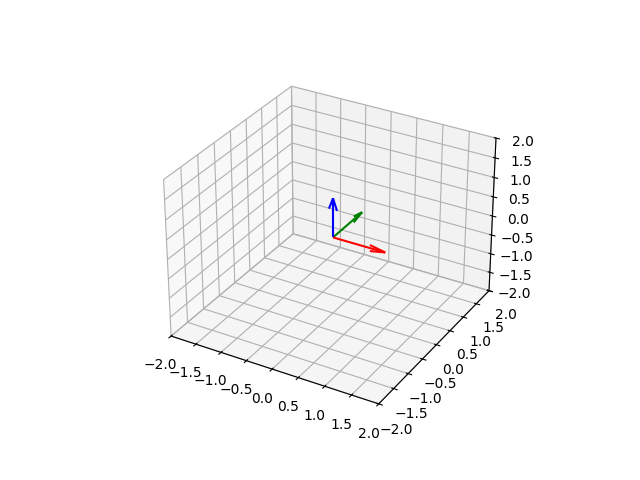

# Sistemas de Coordenadas (3D)

## CoordinateSystem3D

Um sistema de coordenadas 3D definido por três eixos `Direction3D` e uma origem `Point3D`. Internamente constrói uma matriz afim 4×4 para transformações de mudança de base.

```kotlin
import space.CoordinateSystem3D
import space.elements.Direction3D
import space.elements.Point3D
import units.Angle

// Sistema cartesiano destrorso padrão
val standard = CoordinateSystem3D.MAIN_3D_COORDINATE_SYSTEM

// Sistema de coordenadas personalizado
val custom = CoordinateSystem3D(
    xDirection = Direction3D(1.0, 0.0, 0.0),
    yDirection = Direction3D(0.0, 0.0, 1.0),   // eixo y apontando "para cima" = z do mundo
    zDirection = Direction3D(0.0, -1.0, 0.0),  // eixo z apontando "para dentro" = -y do mundo
    origin     = Point3D(1.0, 2.0, 0.0)
)
```

### Propriedades

| Membro | Descrição |
|---|---|
| `xDirection` | Eixo x unitário |
| `yDirection` | Eixo y unitário |
| `zDirection` | Eixo z unitário |
| `origin` | Ponto de origem |
| `matrix` | Matriz de rotação 3×3 |
| `affineMatrix` | Matriz de transformação afim 4×4 |

### Rotação

```kotlin
val sys = CoordinateSystem3D.MAIN_3D_COORDINATE_SYSTEM

// Rotacionar o sistema 45° em torno do eixo z
val rotado = sys.rotate(Direction3D.MAIN_Z_DIRECTION, Angle.Degrees(45.0))
```



---

## Mudança de base (3D)

Qualquer `Entity3D` pode ser reexpresso em outro sistema de coordenadas:

```kotlin
val sistemaA = CoordinateSystem3D(
    xDirection = Direction3D.MAIN_X_DIRECTION,
    yDirection = Direction3D.MAIN_Z_DIRECTION,   // y → z
    zDirection = Direction3D.MAIN_Y_DIRECTION,   // z → y
    origin     = Point3D(1.0, 0.0, 0.0)
)

val ponto = Point3D(2.0, 0.0, 1.0)   // como escrito no sistemaA

val pontoNoMain = ponto.changeBasis(
    asWrittenIn = sistemaA,
    to          = CoordinateSystem3D.MAIN_3D_COORDINATE_SYSTEM
)
```

O cálculo é:

```
to.affineMatrix⁻¹ × asWrittenIn.affineMatrix × ponto.affineMatrix
```

---

## Plane

Um plano 3D definido por um ponto de origem e duas direções geradoras. A direção normal é calculada automaticamente como o produto vetorial dos dois vetores geradores.

```kotlin
import space.Plane
import space.elements.Direction3D
import space.elements.Point3D

val planoXZ = Plane(
    planeOrigin     = Point3D(0.0, 0.0, 0.0),
    planeXDirection = Direction3D.MAIN_X_DIRECTION,
    planeYDirection = Direction3D.MAIN_Z_DIRECTION
)

println(planoXZ.normalDirection)   // Direction3D(0, -1, 0) ou (0, 1, 0)

// Verificar se um ponto está no plano
println(planoXZ.pointIsInPlane(Point3D(3.0, 0.0, 5.0)))   // true
println(planoXZ.pointIsInPlane(Point3D(0.0, 1.0, 0.0)))   // false
```

### Como sistema de coordenadas

Todo `Plane` expõe um `CoordinateSystem3D` para mudanças de base:

```kotlin
val sistemaDeCoord: CoordinateSystem3D = planoXZ.coordinateSystem3D
```
