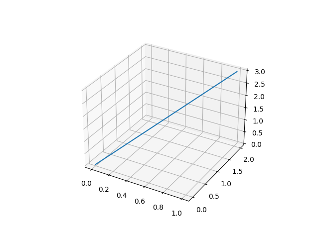
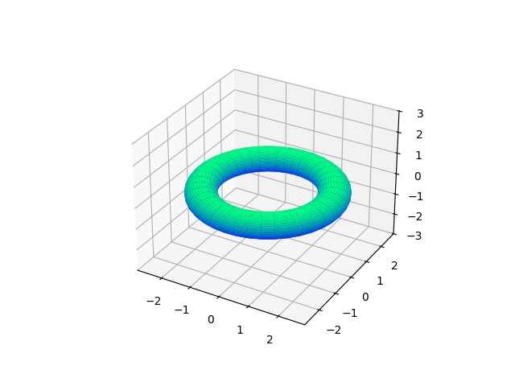
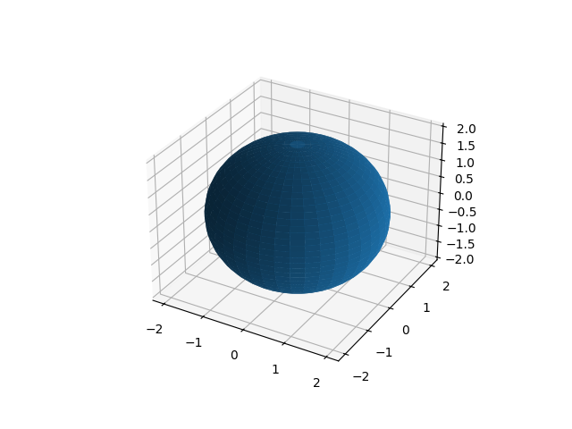
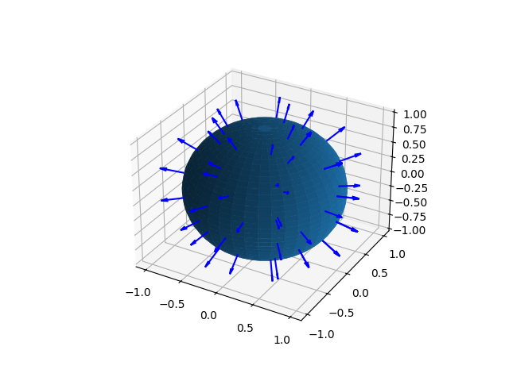
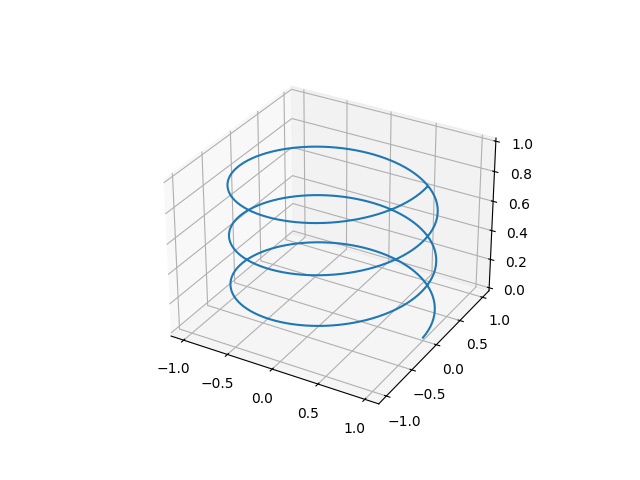

# Curves & Surfaces (3D)

## ParametricCurve3D

A 3D parametric curve defined by three `Function2D` instances — one for each coordinate — evaluated for t ∈ [0, 1].

```kotlin
import space.ParametricCurve3D
import plane.functions.Polynomial
import utils.linspace
import kotlin.math.PI

// Straight line from (0,0,0) to (1,2,3)
val line = ParametricCurve3D(
    xParametricFunction = Polynomial(listOf(0.0, 1.0)),   // x(t) = t
    yParametricFunction = Polynomial(listOf(0.0, 2.0)),   // y(t) = 2t
    zParametricFunction = Polynomial(listOf(0.0, 3.0))    // z(t) = 3t
)

val midPoint: Point3D = line(0.5)   // Point3D(0.5, 1.0, 1.5)

// Evaluate at multiple parameters
val points: List<Point3D> = line(linspace(0.0, 1.0, 50))
```

### Visualization

```kotlin
// requires geomez-visualization
line.plot()
```



---

## ParametricSurface3D

A 3D parametric surface defined by three `Function3D` instances mapping (t, s) → (x, y, z).

### Defining a surface

Implement the three coordinate functions using anonymous objects or lambdas:

```kotlin
import space.ParametricSurface3D
import space.functions.Function3D
import kotlin.math.cos
import kotlin.math.sin

// Torus: r = 2 (major radius), a = 0.5 (tube radius)
val torus = ParametricSurface3D(
    xParametricFunction = object : Function3D {
        override fun invoke(t: Double, s: Double) = (2 + 0.5 * cos(s)) * cos(t)
    },
    yParametricFunction = object : Function3D {
        override fun invoke(t: Double, s: Double) = (2 + 0.5 * cos(s)) * sin(t)
    },
    zParametricFunction = object : Function3D {
        override fun invoke(t: Double, s: Double) = 0.5 * sin(s)
    }
)
```



Or inherit directly to keep things organized:

```kotlin
class Sphere(val radius: Double) : ParametricSurface3D(
    xParametricFunction = object : Function3D {
        override fun invoke(t: Double, s: Double) = radius * cos(t) * sin(s)
    },
    yParametricFunction = object : Function3D {
        override fun invoke(t: Double, s: Double) = radius * sin(t) * sin(s)
    },
    zParametricFunction = object : Function3D {
        override fun invoke(t: Double, s: Double) = radius * cos(s)
    }
)
```

### Evaluating a single point

```kotlin
val sphere = Sphere(radius = 1.0)

val p: Point3D = sphere(t = 0.0, s = Math.PI / 2)   // equator at t=0
```

### Evaluating over a mesh

```kotlin
import utils.linspace
import utils.meshgrid

val (T, S) = meshgrid(
    linspace(0.0, 2 * Math.PI, 40),
    linspace(0.0, Math.PI, 40)
)

// Returns three SimpleMatrix objects (one per coordinate)
val (X, Y, Z) = sphere(T, S)
```

### Visualization

```kotlin
// requires geomez-visualization
import utils.linspace
import utils.meshgrid

val (T, S) = meshgrid(
    linspace(0.0, 2 * Math.PI, 40),
    linspace(0.0, Math.PI, 40)
)
sphere.plot(T, S)
```



### Normal vector

Compute the numerical surface normal at any parameter pair:

```kotlin
val normal: Vector3D = sphere.numericalNormalDirection(t = 0.5, s = 1.0)
// Normal is anchored at the surface point
println(normal.position)   // the point on the surface
```

Sample normals across the surface and overlay them on the sphere plot:

```kotlin
// requires geomez-visualization
import utils.linspace
import utils.meshgrid

val sphere = Sphere(radius = 1.0)

// Coarse parameter grid for the normals
val tValues = linspace(0.0, 2 * Math.PI, 8)
val sValues = linspace(0.5, Math.PI -0.5, 6)

val normals: List<Vector3D> = tValues.flatMap { t ->
    sValues.map { s -> -sphere.numericalNormalDirection(t, s) }
}

// Fine grid for the surface mesh
val (T, S) = meshgrid(
    linspace(0.0, 2 * Math.PI, 40),
    linspace(0.0, Math.PI, 40)
)

pythonExecution {
    val (fig, ax) = sphere.addPlotCommands(T, S)
    normals.addPlotCommands(fig, ax, scale = 0.3)
    show()
}
```



---

## Curve3D

An ordered sequence of `Point3D` values — the 3D counterpart of `Curve2D`. Useful for storing discretized curves or as the result of projecting 2D curves into 3D space.

```kotlin
import space.Curve3D
import space.elements.Point3D

val helix = Curve3D(
    (0..100).map { i ->
        val t = i / 100.0 * 2 * Math.PI
        Point3D(cos(t), sin(t), t / (2 * Math.PI))
    }
)
```



### Visualizing a 2D curve in 3D after a basis change

```kotlin
import plane.Polygon2D
import plane.CoordinateSystem2D
import space.CoordinateSystem3D
import space.Curve3D
import space.elements.Direction3D
import units.Angle

val square = Polygon2D(listOf(
    Point2D(0.0, 0.0), Point2D(1.0, 0.0),
    Point2D(1.0, 1.0), Point2D(0.0, 1.0)
))

// Tilt the polygon 45° and lift it into 3D
val tiltedSystem = CoordinateSystem3D(
    xDirection = Direction3D.MAIN_X_DIRECTION.rotate(
        Direction3D.MAIN_Z_DIRECTION, Angle.Degrees(45.0)
    ) as Direction3D,
    yDirection = Direction3D.MAIN_Z_DIRECTION,
    zDirection = Direction3D.MAIN_Y_DIRECTION.rotate(
        Direction3D.MAIN_Z_DIRECTION, Angle.Degrees(45.0)
    ) as Direction3D
)

val curve3D = Curve3D(
    square.changeBasis(
        asWrittenIn = tiltedSystem,
        to          = CoordinateSystem3D.MAIN_3D_COORDINATE_SYSTEM
    )
)

curve3D.points.plot()   // requires geomez-visualization
```
